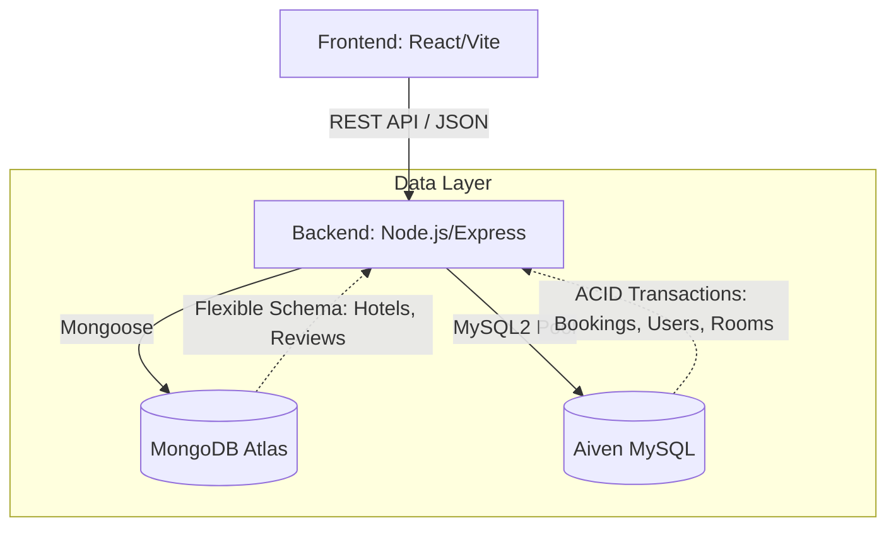

# DaVinci Resort - Enterprise Hotel Reservation Platform


> **Live Demo:** [https://hotel-reservation-swart-three.vercel.app](https://hotel-reservation-swart-three.vercel.app)

DaVinci Resort is a highly scalable, full-stack enterprise hotel management and reservation system. It demonstrates advanced architectural patterns, including **Polyglot Persistence** (combining SQL and NoSQL databases) to achieve both structural flexibility for catalog data and strict ACID compliance for financial transactions.

## 🚀 Key Features

- **Advanced Search & Booking Engine:** Real-time room availability checking, dynamic pricing, and complex filtering (location, room type, amenities).
- **Polyglot Database Architecture:**
  - **MongoDB (NoSQL):** Handles unstructured and rapidly evolving data such as Hotel Profiles, Galleries, Amenities, and User Reviews.
  - **MySQL (SQL):** Enforces strict relational integrity and ACID compliance for core business logic including Reservations, Payments, Financial Ledgers, and Room Inventory.
- **Database Optimization:** Utilizes advanced **Stored Procedures** and **Custom Functions** in MySQL to offload complex aggregation logic (e.g., checking date overlaps, quarterly revenue reports) directly to the database engine, minimizing backend memory consumption.
- **Modern UI/UX:** Built with React & Tailwind CSS. Features skeleton loaders, smooth micro-interactions, state management, and a fully responsive design for seamless mobile and desktop experiences.
- **Secure Authentication:** Implements JWT-based authentication, bcrypt password hashing, and Role-Based Access Control (RBAC) separating Customers and Administrators.

## 🛠 Technology Stack

### Frontend
- **Framework:** React 18 (Vite)
- **Styling:** Tailwind CSS
- **Routing & State:** React Router DOM, React Hooks
- **Icons & UI:** Lucide React, Custom CSS Animations
- **Hosting:** Vercel

### Backend
- **Runtime & Framework:** Node.js, Express.js
- **Authentication:** JSON Web Tokens (JWT), bcrypt
- **Validation & Security:** Custom Middlewares, CORS
- **Hosting:** Render Web Services

### Database
- **NoSQL:** MongoDB Atlas (Mongoose ODM)
- **SQL:** Aiven MySQL Cloud (mysql2 driver, Stored Procedures, Functions)

## 🏗 System Architecture



## 💻 Getting Started (Local Development)

### Prerequisites
- Node.js (v18+)
- MySQL (v8.0+)
- MongoDB (v6.0+)

### Installation

1. **Clone the repository:**
   ```bash
   git clone https://github.com/your-username/HotelReservation.git
   cd HotelReservation
   ```

2. **Setup Backend:**
   ```bash
   cd server
   npm install
   ```
   Create a `.env` file in the `/server` directory and configure your Database connections:
   ```env
   NODE_ENV=development
   PORT=5000
   MYSQL_HOST=localhost
   MYSQL_USER=root
   MYSQL_PASSWORD=yourpassword
   MYSQL_DATABASE=hotelreservation
   MONGODB_URI=mongodb://localhost:27017
   MONGODB_DATABASE=hotelreservation
   JWT_SECRET=your_jwt_secret_key
   ```
   *Note: Ensure you import the provided `hotelreservation.sql` script into your local MySQL instance.*

3. **Setup Frontend:**
   ```bash
   cd ../client
   npm install
   ```
   Create a `.env` file in the `/client` directory:
   ```env
   VITE_API_BASE_URL=http://localhost:5000/api
   ```

4. **Run the Application:**
   Open two terminal windows:
   ```bash
   # Terminal 1: Start Backend
   cd server
   npm start
   
   # Terminal 2: Start Frontend
   cd client
   npm run dev
   ```

## 🛡️ License
This project is for educational and portfolio demonstration purposes.

---
*Designed & Developed by Tran Tuan Kiet*
